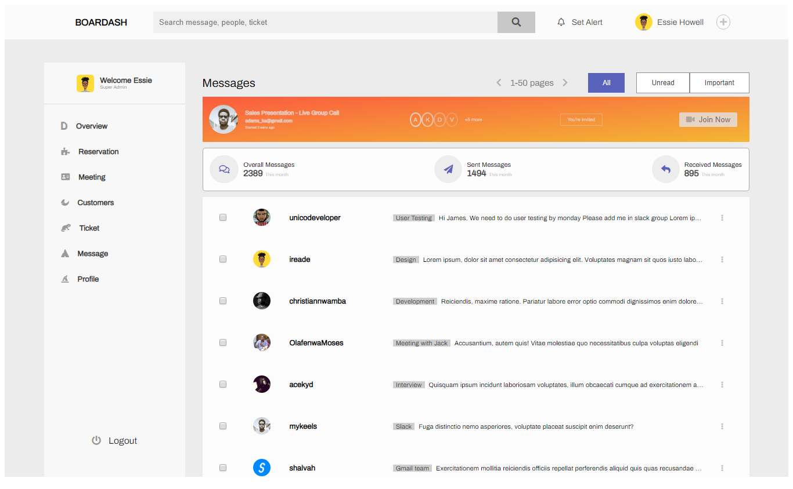

### Installation & Setup

  Clone this repository and install its dependencies.

        > git clone https://github.com/temmietope/dashboard-ui

        > cd dashboard-ui

        > npm install

        > npm start

  Application is live on port 3000

        http://localhost:3000

  Or you can view online on [https://employeedashboardd.netlify.com/](https://employeedashboardd.netlify.com/)

### Screenshots

### Repository

[https://github.com/temmietope/dashboard-ui](https://github.com/temmietope/dashboard-ui)